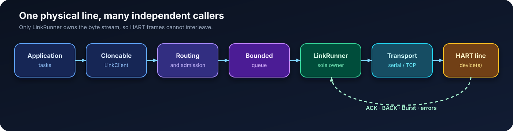
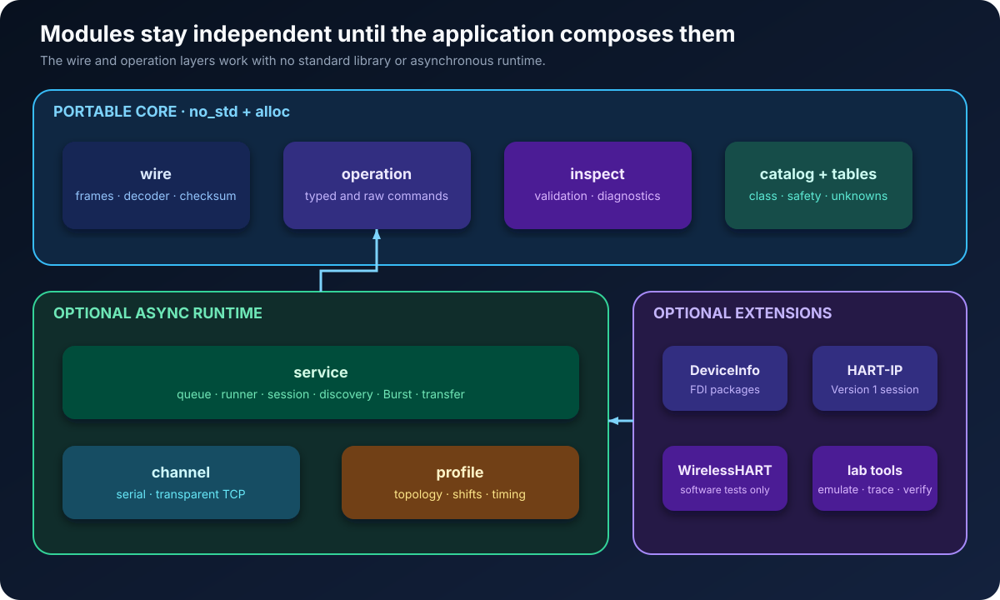
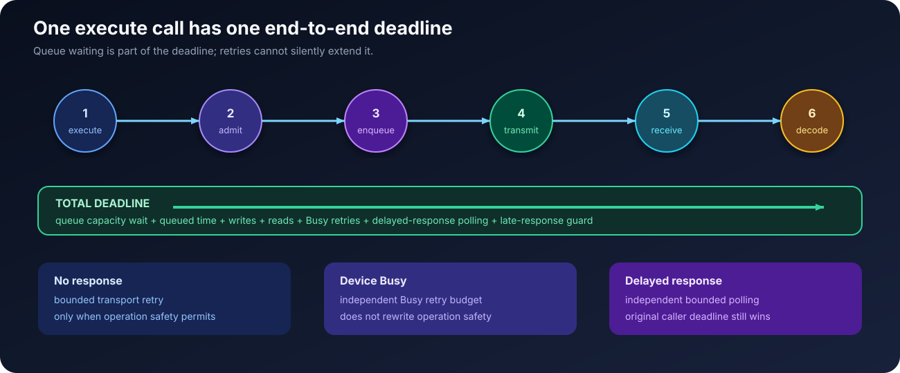
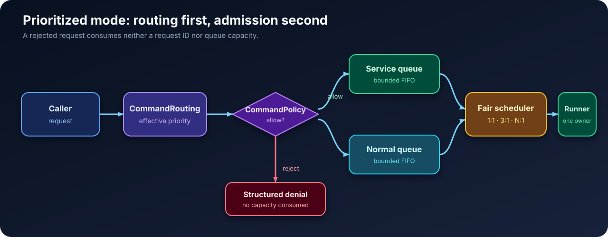
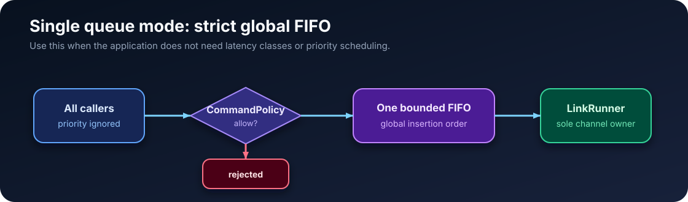
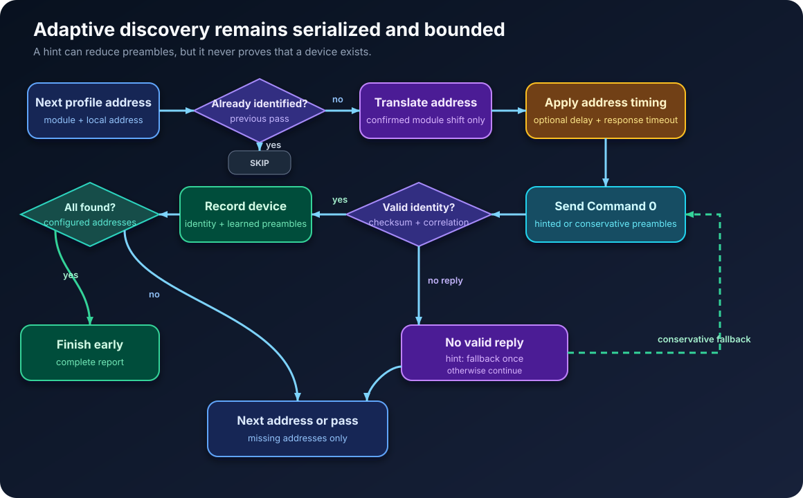

# HartLink

[](https://crates.io/crates/hart-link)
[](https://docs.rs/hart-link)
[](https://github.com/asaopas/hart-link)

HartLink is a pure-Rust toolkit for building HART masters, gateways, diagnostic
tools, and device-management applications. It covers the path from raw wire
bytes to typed operations and provides an asynchronous runner that safely
serializes many callers over one physical HART line.

The protocol core is `no_std`. Transport, queue, discovery, session, emulator,
HART-IP, DeviceInfo-style schemas, and host-side WirelessHART components are
opt-in Cargo features.

> **Hardware status:** wired HART communication has been exercised through a
> transparent Moxa TCP gateway and directly through a USB HART modem. The
> `wireless-hart` feature is covered by software tests, but has not yet been
> exercised against real WirelessHART radios and Network Managers.

## Understand HartLink in one minute

| If you need to... | Start with... |
|---|---|
| inspect or construct a HART frame without I/O | `Address`, `Request`, `Frame`, `FrameDecoder`, `inspect_bytes` |
| read a known device over TCP or serial | `LinkBuilder`, `LinkClient`, and a typed operation |
| share one line between many tasks | clone `LinkClient`; keep exactly one `LinkRunner` for the channel |
| discover devices behind a gateway or module | `LineProfile` and `discover_line` |
| send a vendor-specific command | `RawOperation` or a custom `Operation` implementation |
| choose strict priorities or plain FIFO | `QueueScheduling` or `LinkBuilder::single_queue` |
| test without hardware | the `emulator`, `trace`, and `verification` modules |
| use only parsing in firmware | disable default features; the wire and operation core stays `no_std` |

The central rule is simple: application code owns cloneable clients; the
runner owns the physical stream. This prevents concurrent requests from
interleaving bytes on a shared HART medium.



## What is included

| Layer | Supported behavior |
|---|---|
| Wire protocol | short and long addresses, FSK and PSK, STX/ACK/BACK, up to three header-extension bytes, checksum validation, and standard or expanded commands in `0..=65535` through Command 31 |
| Streaming input | arbitrary fragmentation, bounded buffering, recovery after noise or damaged frames, local-echo removal, and stale/late-response filtering |
| Operations | typed identification, process-value, text, configuration, diagnostics, and control operations; checked raw and custom vendor operations |
| Execution | bounded queues, cancellation, coalescing of compatible reads, end-to-end deadlines, retry-safety rules, Busy retry, and delayed-response polling |
| Discovery and sessions | module address shifts, adaptive preambles, bounded hints, per-address timing, device sessions, partial snapshots, health cooldown, and adaptive read timing |
| Transports and labs | serial, transparent serial-over-TCP, byte-exact record/replay, PCAP-NG capture, in-memory emulation, and bounded fault injection |
| Optional models | DeviceInfo-style schemas, bounded FDI/ZIP extraction, HART-IP Version 1 Token-Passing sessions, and software-tested host-side WirelessHART state management |

HartLink preserves unknown values and raw payloads instead of inventing their
meaning. Typed support requires a known public, licensed, or vendor-provided
payload definition.

## Hardware validation status

| Path | Current evidence |
|---|---|
| transparent serial-over-TCP | exercised with real HART 5, 6, and 7 devices through a Moxa gateway |
| direct wired HART | exercised with real devices through a USB HART modem |
| emulator and fault injection | covered by automated fragmentation, noise, timeout, retry, queue, and resource-limit tests |
| WirelessHART | software-tested host-side state only; real radio, gateway, and Network Manager validation is still pending |

Hardware observations are interoperability evidence for the tested setup, not
FieldComm certification or a guarantee for every modem and device revision.

## Installation

The default build provides the asynchronous runtime and transparent TCP
transport:

```toml
[dependencies]
hart-link = "0.2"
```

Choose only the hardware and subsystems the application actually uses:

```toml
# Parser, encoder, inspector, operations, and common tables; no std or Tokio.
hart-link = { version = "0.2", default-features = false }

# Runtime with both transparent TCP and serial transports.
hart-link = { version = "0.2", features = ["serial"] }

# Every optional subsystem, useful for a desktop laboratory tool.
hart-link = { version = "0.2", features = ["full"] }
```

## Architecture

```text
src/
├── wire/          addresses, delimiters, frames, checksum, streaming decoder
├── operation/     domain-oriented request and response semantics
├── catalog.rs     explicit command class and retry-safety registry
├── inspect.rs     frame and complete-exchange validation
├── service/       queue, runner, session, discovery, Burst, and transfer
├── channel/       independent TCP and serial byte channels
├── device/        dynamic schemas for specific devices
├── ip.rs          HART-IP packet session
├── mesh/          software-tested host-side WirelessHART mechanisms
├── emulator.rs    in-memory link, device, noise, and failures
├── trace.rs       recording, PCAP-NG, and deterministic replay
└── profile.rs     link, module, address-offset, and timing settings
```

The wire layer does not depend on typed operations. Operations do not depend on
Tokio, TCP, or serial ports. Only `LinkRunner` owns the physical channel, while
`LinkClient` can be cloned for independent application components.



## Feature selection

| Feature | Purpose |
|---|---|
| no features | `no_std` wire types, operations, inspector, and tables |
| `runtime` | queue, runner, session, and Tokio integration |
| `tcp` | transparent serial-over-TCP channel |
| `serial` | serial modem channel |
| `device-info` | dynamic schemas and JSON catalog |
| `fdi-package` | bounded loading of matching JSON profiles from ZIP/FDI containers |
| `hart-ip` | HART-IP Version 1 packet session and Token-Passing adapter |
| `wireless-hart` | experimental host-side admission, key custody, replay protection, graph, routes, and schedules; real hardware validation pending |
| `emulator` | in-memory link, device, and fault injection |
| `cli` | local frame inspector and request builder |
| `full` | every library subsystem |

Features are additive. The default set is `runtime + tcp`; enabling `serial`
does not disable TCP. The `full` feature is convenient for tools and labs, but
libraries should normally enable only the required pieces.

Check the minimal core with:

```text
cargo check --no-default-features
```

## Quick start: inspect a frame without hardware

This path needs no runtime, socket, or serial port. It is suitable for packet
inspectors, capture analysis, and embedded applications:

```rust
use hart_link::{Address, Master, Request, inspect_bytes};

let address = Address::polling(0, Master::Primary)?;
let bytes = Request::new(address, 0u8, vec![])
    .to_frame()?
    .encode()?;
let report = inspect_bytes(&bytes).map_err(|issue| issue.message)?;
assert_eq!(report.command.get(), 0);
# Ok::<(), Box<dyn std::error::Error>>(())
```

## Quick start: read a device through transparent TCP

Create the channel once, start one runner, and clone the client wherever the
application needs access to the line:

```rust,no_run
use std::time::Duration;
use hart_link::{Address, LinkBuilder, LinkConfig, Master, Priority, RetryPolicy};
use hart_link::channel::{TcpChannel, TcpOptions};
use hart_link::operation::ReadDeviceIdentity;

# async fn example() -> Result<(), Box<dyn std::error::Error>> {
let channel = TcpChannel::connect("192.0.2.10:4002", TcpOptions::default()).await?;
let retry = RetryPolicy::default()
    .with_response_timeout(Duration::from_secs(2))
    .with_total_timeout(Duration::from_secs(10));
let (client, runner) = LinkBuilder::new(channel)
    .config(LinkConfig::default().with_queue_capacities(32, 512))
    .queue_scheduling(hart_link::QueueScheduling::EQUAL)
    .default_priority(Priority::Service)
    .default_retry(retry)
    .event_capacity(1024)
    .maximum_coalesced(64)
    .build()?;
tokio::spawn(runner.run());

let address = Address::polling(0, Master::Primary)?;
let identity = client.execute_default(address, &ReadDeviceIdentity).await?;
println!("type: {}, id: {:06X}", identity.device_type, identity.device_id);
# Ok(())
# }
```

To scan a known polling range instead of addressing one known device, reuse the
same client and describe the physical line explicitly:

```rust,no_run
use hart_link::Master;
use hart_link::profile::{LineProfile, PollingWindow};
use hart_link::service::discover_line;
# use hart_link::LinkClient;

# async fn scan(client: &LinkClient) -> Result<(), Box<dyn std::error::Error>> {
let profile = LineProfile::single_segment(
    "line-1",
    PollingWindow::new(0, 15)?,
)
.with_discovery_preambles(20);

let report = discover_line(client, &profile, Master::Primary).await?;
for device in report.devices {
    println!(
        "address={:?}, HART={}, type={}, id={:06X}",
        device.address,
        device.identity.universal_revision,
        device.identity.device_type,
        device.identity.device_id,
    );
}
# Ok(())
# }
```

An `execute` call covers the complete lifecycle below. Its total deadline starts
before enqueueing, so time spent waiting behind other commands is never hidden.



## Queue modes and scheduling

HartLink has two explicit queue models. Select the simplest one that matches
the application:

| Mode | Ordering | Best fit |
|---|---|---|
| prioritized queues | weighted service/normal scheduling | interactive tools, shared gateways, and systems with latency classes |
| one global queue | strict bounded FIFO; supplied priorities are ignored | one producer, simple polling loops, and applications that do not need priority |

In prioritized mode the request first receives its effective queue, is then
checked by `CommandPolicy`, and only then consumes queue capacity:



Queue scheduling changes latency distribution, not physical HART throughput.
If either queue is empty, the other proceeds immediately without artificial
pauses.

| Preset | Service : normal | Meaning |
|---|---:|---|
| `QueueScheduling::EQUAL` | `1:1` | alternate while both queues have work |
| default | `3:1` | favor service traffic without starving normal work |
| `QueueScheduling::MAXIMUM_SERVICE` | `255:1` | strongest bounded service preference |
| `QueueScheduling::custom(n)` | `n:1` | validated application-specific ratio |

`MAXIMUM_SERVICE` remains starvation-free, but a normal request can still use
up its own deadline while waiting behind a sustained service load. A custom
ratio is validated explicitly:

```rust,no_run
use hart_link::{LinkBuilder, QueueScheduling};
# use hart_link::emulator::MemoryChannel;
# fn example() -> Result<(), Box<dyn std::error::Error>> {
# let (channel, _) = MemoryChannel::try_pair(8)?;
let scheduling = QueueScheduling::custom(4)?;
let (_client, _runner) = LinkBuilder::new(channel)
    .queue_scheduling(scheduling)
    .build()?;
# Ok(())
# }
```

Existing `with_service_weight` and `service_weight` methods remain available
for compatibility.

## One queue, routing, and command admission

Applications that do not need priorities can select one bounded global FIFO.
In this mode every caller shares the same ordering and supplied priorities are
ignored:



```rust,no_run
use hart_link::LinkBuilder;
# use hart_link::emulator::MemoryChannel;
# fn example() -> Result<(), Box<dyn std::error::Error>> {
# let (channel, _) = MemoryChannel::try_pair(8)?;
let (_client, _runner) = LinkBuilder::new(channel)
    .single_queue(256)
    .build()?;
# Ok(())
# }
```

With prioritized queues, routing runs first and admission runs second. The
policy therefore sees the effective queue, not merely the priority requested
by the caller. A rejected request does not consume a request identifier or any
queue capacity and increments `LinkSnapshot::denied`:

```rust,no_run
use hart_link::{CommandCode, CommandPolicy, CommandRouting, LinkBuilder, Priority};
# use hart_link::emulator::MemoryChannel;
# fn example() -> Result<(), Box<dyn std::error::Error>> {
# let (channel, _) = MemoryChannel::try_pair(8)?;
let service_commands = [CommandCode::new(0), CommandCode::new(13)];
let policy = CommandPolicy::retry_safe().and(CommandPolicy::queue_allowlist(
    Priority::Service,
    service_commands,
));
let (_client, _runner) = LinkBuilder::new(channel)
    .command_routing(CommandRouting::service_commands(service_commands))
    .command_policy(policy)
    .build()?;
# Ok(())
# }
```

Built-in policies include allow-all, read-only, retry-safe, command allow-list,
command deny-list, and an allow-list for one effective priority. The read-only
and retry-safe policies trust only the built-in command registry: a caller
cannot bypass them by changing `Request::retry_safety`. An unknown vendor
command must be admitted explicitly, for example by composing a reviewed
command allow-list with `or`. Policies can be combined with `and` or `or`;
`CommandPolicy::custom` receives the full immutable request, both effective and
catalog safety, and the effective priority. Admission is a local safety
boundary, not authentication or authorization of a remote user.

## Managed device health and adaptive timing

`ManagedDeviceSession` adds an optional health layer around an identified
`DeviceSession`. Repeated transport outages open a bounded cooldown, so callers
fail locally instead of filling the shared queue with requests to an offline
device. A deliberate `probe` can bypass cooldown only for a command that the
built-in catalog classifies as read-only. Request metadata and vendor safety
claims cannot widen that exception.

Successful read-only exchanges teach a smoothed response duration. A later
read may use one shorter first attempt and then fall back to the caller's
conservative timeout. This optimization consumes, rather than adds, one
transport retry and never extends the original end-to-end deadline. Writes,
actions, unknown commands, Busy handling, and delayed-response polling retain
their caller-selected behavior.

```rust,no_run
use std::{num::NonZeroU8, time::Duration};
use hart_link::{AdaptiveTiming, DeviceHealthOptions};
# use hart_link::service::DeviceSession;
# fn example(session: DeviceSession) -> Result<(), Box<dyn std::error::Error>> {
let options = DeviceHealthOptions::default()
    .with_failure_threshold(NonZeroU8::new(3).unwrap())
    .with_cooldown(Duration::from_secs(10))
    .with_adaptive(Some(
        AdaptiveTiming::default()
            .with_minimum(Duration::from_millis(100))
            .with_maximum(Duration::from_secs(2)),
    ));
let managed = session.managed(options)?;
let health = managed.snapshot();
assert_eq!(health.cooldown_rejections, 0);
# Ok(())
# }
```

## Partial device snapshots

`DeviceSession::snapshot` collects identity, process values, tags, and
additional status without turning one unsupported or failed command into the
loss of every successful field. Each requested field is represented as a
value, a retained command error, or an explicit unsupported state. Optional
groups can be disabled with `SnapshotOptions`, including an identity-only
snapshot that performs no I/O.

```rust,no_run
use hart_link::{SnapshotOptions, service::DeviceSession};
# async fn example(session: &DeviceSession) {
let snapshot = session.snapshot(SnapshotOptions::FULL).await;
if let Some(primary) = snapshot.primary_value.value() {
    println!("PV: {} (unit {})", primary.value, primary.unit);
}
for error in [snapshot.dynamic_values.error(), snapshot.tag.error()]
    .into_iter()
    .flatten()
{
    eprintln!("Command {}: {}", error.command.get(), error.message);
}
# }
```

## Damaged-frame policy

Checksum validation is strict by default. Known hardware defects must be
enabled explicitly with `ChecksumPolicy::KnownGateway`. Every frame accepted by
that policy carries a `FrameRepair` value; unrelated checksum mismatches are
never repaired automatically.

## Device warnings

Typed operations reject every nonzero response code by default. If the exact
command specification or exact-revision DeviceInfo marks a code as a warning,
pass only that code to `execute_accepting`. The returned `CommandOutcome<T>`
contains both the decoded value and the original response code/device status.
Communication-error summaries are never accepted as application warnings.

## Arbitrary and vendor commands

`RawOperation` and `Request` support every logical command number in
`0..=65535`; commands above 255 are carried through Command 31. The crate does
not invent unknown payload layouts. A vendor codec can implement `Operation`,
and a known read-only or idempotent vendor operation can explicitly declare its
retry safety. Unknown operations remain `Action`, so uncertain transport
failures are not retried automatically.

Commands that derive calibration from a live physical input, including 36 and
37, are also classified as actions. A missing response therefore never causes
HartLink to repeat the physical calibration automatically.

The shorter constructors make that intent visible at the call site:
`RawOperation::read`, `RawOperation::idempotent_write`, and
`RawOperation::action`.

## Resource and timeout guarantees

- the streaming decoder retains only its configured tail and never copies an
  oversized fragment before applying that limit;
- validated link construction rejects zero, undersized, or implausibly large
  queues and buffers before calling Tokio allocation primitives;
- a trace is bounded independently by record count and total payload bytes;
- deterministic replay validates both step count and aggregate payload size and
  stops immediately when an iterator exceeds either budget;
- transparent TCP connection establishment has a ten-second default deadline
  and an explicit `connect_with_timeout` variant; zero or implausibly large
  connect, keepalive, and HART-IP durations are rejected;
- direct HART-IP use has socket and whole-exchange deadlines, so a peer cannot
  keep one request alive indefinitely by publishing unrelated packets;
- HART-IP Publish retention, stale correlation, Burst fingerprints, subscriber
  backlogs, package extraction, and block receive buffers are bounded;
- frame inspectors reject input larger than any canonical HART frame before
  decoding Base64 or hexadecimal payloads;
- emulator queues, injected noise, direct transmissions, fragmentation, and
  artificial latency have hard safety bounds with strict constructors;
- cooldown, adaptive timing, and all retry durations have explicit hard limits,
  and cooldown rejection occurs before queue capacity or request identifiers
  are consumed.

`LinkBuilder`, `RetryPolicy`, `LinkConfig`, `TcpOptions`, `TimingProfile`,
`LineProfile`, `DiscoveryOptions`, `BurstConfig`, `TraceLimits`, `ReplayLimits`,
`PackageLimits`, `CatalogLimits`, `TableRepositoryLimits`, `DeviceHealthOptions`,
`AdaptiveTiming`, and `SnapshotOptions` provide fluent setters for common
configuration. `Request::try_new`, `ReplayChannel::new`,
`MemoryChannel::try_pair`, and `MemoryChannel::try_set_faults` reject invalid
input at the call site. Public fields remain available when direct construction
is clearer.

## Safe adaptive discovery

Selected physical polling addresses can receive an additional pre-probe delay
and their own response timeout without slowing every other address. Overrides
use the address after applying a confirmed module shift:



```rust,no_run
use std::time::Duration;
use hart_link::profile::{AddressTiming, AddressTimings};

let timings = AddressTimings::new().with(
    17,
    AddressTiming::new()
        .with_delay_before_probe(Duration::from_millis(500))
        .with_response_timeout(Duration::from_secs(8)),
)?;
# Ok::<(), hart_link::profile::AddressTimingError>(())
```

Pass this set to `discover_line_with_address_timings`; ordinary
`discover_line` and `discover_line_with_options` retain the line-wide timing.

`discover_line_with_options` scans each configured address sequentially and
skips addresses already identified on an earlier pass. A complete pass exits
immediately when every configured address answered, so extra passes do not add
an unconditional delay.

`DiscoveryHints` may contain a previously confirmed request-preamble count for
an exact short address. Hints are bounded and validated, affect only the first
probe, and never supply identity or prove that a device is present. If a hinted
probe times out, discovery immediately retries that address with the
conservative `LineProfile::discovery_preambles` value and the configured retry
budget. `DiscoveryReport::hinted_attempts` and `hint_fallbacks` expose both
paths for monitoring and regression tests.

Discovery remains serialized because a HART physical link is a shared medium.
Running address probes in parallel would make frames collide and is not a safe
performance optimization.

## WirelessHART hardware feedback

The `wireless-hart` feature has automated coverage for admission decisions,
key erasure, replay protection, topology, routes, schedules, and resource
limits. It has not yet been validated against a broad matrix of real radios,
gateways, Network Managers, and device firmware. HartLink therefore does not
claim complete over-the-air interoperability or FieldComm conformance.

This limitation applies specifically to WirelessHART. The ordinary wired HART
path has already been exercised through a transparent Moxa TCP gateway and a
direct USB HART modem.

If real hardware behaves differently, open a
[WirelessHART hardware report](https://github.com/asaopas/hart-link/issues/new?template=wirelesshart-hardware.yml).
A useful report contains:

- the HartLink version or commit and enabled Cargo features;
- host OS, gateway or Network Manager model, device model, and firmware
  revisions;
- the exact operation, expected result, actual result, and whether the failure
  is repeatable;
- monotonic timestamps and the event order leading to the failure;
- a minimal sanitized configuration plus logs;
- the smallest raw hexadecimal dump, PCAP-NG capture, or byte-exact trace that
  reproduces the behavior.

Do **not** publish join keys, network or session keys, passwords, private
certificates, licensed specification text, proprietary DeviceInfo packages, or
unrelated production traffic. Replace secrets with fixed placeholders while
preserving byte lengths and message ordering. Hardware reports are used to add
a regression case first and then adjust the implementation without guessing.

## Boundaries

The built-in catalog does not replace licensed Common Tables, Command Summary,
Common Practice Commands, Block Transfer, or vendor DeviceInfo content. The
current internal JSON model is DeviceInfo-style; it is not a complete importer
for every official DeviceInfo XML/JSON revision. Unknown values and raw payload
bytes are preserved, but their semantics must come from a lawfully available
source.

The HART-IP feature implements the publicly documented Version 1 stream session
and Token-Passing PDU path, including TCP. It does not claim UDP session-port
handling, Direct PDU, later protocol-version security, or official HART-IP
conformance. The WirelessHART feature is software-tested host-side state
machinery, not a hardware-validated radio stack, cryptographic join
implementation, or complete Network Manager. The host-side manager exposes no
unauthenticated join shortcut: applications must provide a verifier, keys are
redacted and zeroized, and replacing a key invalidates active state. The block
helper enforces bounded ordering but does not claim the complete licensed Block
Transfer 2.0 command state machine.

HART 7.10 introduced specification revisions and Command 554. HartLink can
carry Command 554 through the raw expanded-command API, but a typed codec must
not be added without the normative request/response format. Local tests prove
the implemented software contracts; they are not FieldComm Group product
certification or evidence of electrical interoperability.

Official entry points:

- [HART specifications](https://www.fieldcommgroup.org/hart-specifications)
- [HART protocol change log](https://support.fieldcommgroup.org/support/solutions/articles/8000056458-change-log-for-the-hart-protocol-specifications)
- [DeviceInfo](https://www.fieldcommgroup.org/integration-technologies/deviceinfo)
- [DeviceInfo technical overview](https://www.fieldcommgroup.org/sites/default/files/imce_files/technology/documents/FCG_AG21073%7B2.2%7D_HART_DeviceInfo-Technical_Overview.pdf)
- [HART-IP](https://www.fieldcommgroup.org/technologies/hart-ip)
- [Public HART-IP Version 1 packet overview](https://www.fieldcommgroup.org/sites/default/files/imce_files/technology/documents/HART_IP_%20Application_Communication_Analysis_r1.0.pdf)
- [WirelessHART](https://www.fieldcommgroup.org/technologies/wirelesshart)
